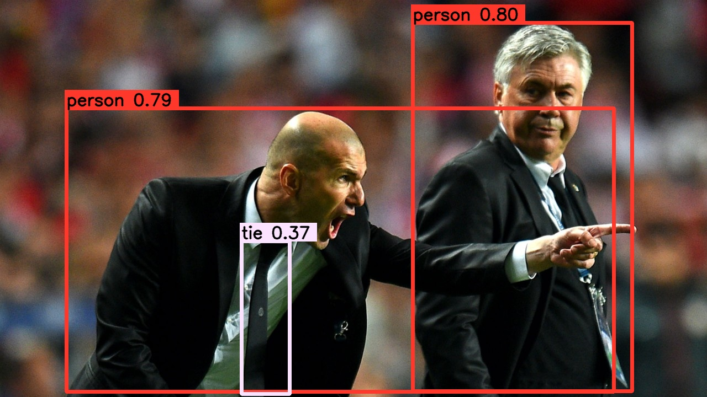

## B站教学视频

**TODO**

## Introduction

- 基于**Tensorrt**加速**Yolov8**，本项目采用**ONNX转Tensorrt**方案
- 支持**Windows10**和**Linux**
- 支持**Python/C++**

## YOLOv8

<div align="center">

</div>
## Environment

- **Tensorrt 8.4.3.**
- **Cuda 11.6 Cudnn 8.4.1**
- **onnx 1.12.0**

## Quick Start

安装**yolov8**仓库，并下载官方模型。

```
pip install ultralytics==8.0.5
pip install onnx==1.12.0
# download offical weights(".pt" file)
https://github.com/ultralytics/assets/releases/download/v0.0.0/yolov8n.pt
```

使用官方命令**导出ONNX模型**。

```
yolo mode=export model=yolov8n.pt format=onnx dynamic=False
```

使用本仓库**v8_transform.py转换官方的ONNX模型**，会自动生成yolov8n.transd.onnx。

```
python v8_transform.py yolov8n.onnx
```

将生成的**onnx**模型复制到**tensorrt/bin**文件夹下，使用官方**trtexec**转化onnx模型。**FP32预测删除`--fp16`参数即可**。

```
trtexec --onnx=yolov8n.transd.onnx --saveEngine=yolov8n_fp16.trt --fp16
```

## C++

配置**Opencv**、**Tensorrt**环境，具体可参考https://github.com/Monday-Leo/Yolov5_Tensorrt_Win10，此处省略。

打开本仓库的**CMakeLists.txt**，修改**Opencv**、**Tensorrt**路径，之后cmake。

```
#change to your own path
##################################################
set(OpenCV_DIR "E:/opencv/build")  
set(TRT_DIR "E:/TensorRT-8.4.3.1")  
##################################################
```

<div align="center">

</div>

将**预测图片zidane.jpg和模型yolov8n_fp16.trt放入exe文件夹**，直接运行程序，**没有做warmup预测，首次预测时间不准**，想要精确计时请自行修改代码做warmup。**想要修改模型路径和图片路径请修改主程序。**

```
int main() {
	std::string img_path = "zidane.jpg";
	std::string model_path = "yolov8n_fp16.trt";
	single_inference(img_path,model_path);
	return 0;
}
```

<div align="center">

</div>
## Python

在刚才的C++工程中右键yolov8，点击属性，修改为**动态链接库**。

<div align="center">

</div>
将本仓库的**python_trt.py**复制到dll文件夹下。

<div align="center">

</div>
设置模型路径，**dll**路径和想要预测的图片路径，特别注意模型**路径需要加b''**

```
det = Detector(model_path=b"./yolov8n_fp16.trt",dll_path="./yolov8.dll")  # b'' is needed
img = cv2.imread("./zidane.jpg")
```

<div align="center">

</div>
## Reference

https://github.com/ultralytics/ultralytics

https://github.com/shouxieai/infer
